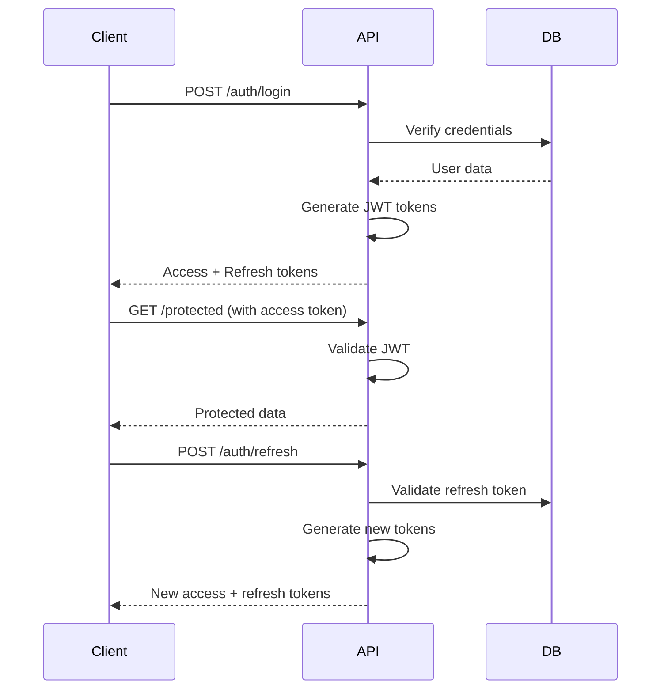

# User Authentication and Multi-Tenancy Architecture Design

## Overview

This design document outlines a comprehensive user authentication and multi-tenancy system for the PulseAPI monitoring platform. The system implements advanced Role-Based Access Control (RBAC) with custom permissions and enterprise-grade multi-tenancy.

## Architecture Overview

### Core Components

1. **Authentication System**
   - JWT-based authentication with refresh tokens
   - Password hashing and secure credential management
   - Session management and token invalidation

2. **Multi-Tenancy System**
   - Organization-based tenant isolation
   - Team hierarchies within organizations
   - Data isolation at database level

3. **Authorization System**
   - Advanced RBAC with custom permissions
   - Role inheritance and permission cascading
   - Resource-level access control

4. **Security Framework**
   - Middleware-based authentication guards
   - Permission-based route protection
   - Audit logging and security monitoring

## Database Schema Design

### Core Entities

#### User
```sql
CREATE TABLE users (
    id UUID PRIMARY KEY,
    organization_id UUID NOT NULL,
    email VARCHAR(255) UNIQUE NOT NULL,
    password_hash VARCHAR(255) NOT NULL,
    first_name VARCHAR(100),
    last_name VARCHAR(100),
    is_active BOOLEAN DEFAULT TRUE,
    email_verified BOOLEAN DEFAULT FALSE,
    email_verification_token VARCHAR(255),
    password_reset_token VARCHAR(255),
    password_reset_expires_at TIMESTAMP,
    last_login_at TIMESTAMP,
    created_at TIMESTAMP NOT NULL,
    updated_at TIMESTAMP NOT NULL,
    FOREIGN KEY (organization_id) REFERENCES organizations(id)
);
```

#### Organization
```sql
CREATE TABLE organizations (
    id UUID PRIMARY KEY,
    name VARCHAR(255) NOT NULL,
    slug VARCHAR(100) UNIQUE NOT NULL,
    domain VARCHAR(255),
    subscription_plan VARCHAR(50) DEFAULT 'free',
    max_users INTEGER DEFAULT 10,
    max_monitors INTEGER DEFAULT 50,
    is_active BOOLEAN DEFAULT TRUE,
    created_at TIMESTAMP NOT NULL,
    updated_at TIMESTAMP NOT NULL
);
```

#### Role
```sql
CREATE TABLE roles (
    id UUID PRIMARY KEY,
    organization_id UUID NOT NULL,
    name VARCHAR(100) NOT NULL,
    description TEXT,
    is_system_role BOOLEAN DEFAULT FALSE,
    created_at TIMESTAMP NOT NULL,
    updated_at TIMESTAMP NOT NULL,
    FOREIGN KEY (organization_id) REFERENCES organizations(id),
    UNIQUE(organization_id, name)
);
```

#### Permission
```sql
CREATE TABLE permissions (
    id UUID PRIMARY KEY,
    organization_id UUID NOT NULL,
    resource VARCHAR(100) NOT NULL,
    action VARCHAR(100) NOT NULL,
    name VARCHAR(255) NOT NULL,
    description TEXT,
    is_system_permission BOOLEAN DEFAULT FALSE,
    created_at TIMESTAMP NOT NULL,
    FOREIGN KEY (organization_id) REFERENCES organizations(id),
    UNIQUE(organization_id, resource, action)
);
```

#### Role Permission
```sql
CREATE TABLE role_permissions (
    role_id UUID NOT NULL,
    permission_id UUID NOT NULL,
    PRIMARY KEY (role_id, permission_id),
    FOREIGN KEY (role_id) REFERENCES roles(id) ON DELETE CASCADE,
    FOREIGN KEY (permission_id) REFERENCES permissions(id) ON DELETE CASCADE
);
```

#### User Role
```sql
CREATE TABLE user_roles (
    user_id UUID NOT NULL,
    role_id UUID NOT NULL,
    assigned_by UUID NOT NULL,
    assigned_at TIMESTAMP NOT NULL,
    PRIMARY KEY (user_id, role_id),
    FOREIGN KEY (user_id) REFERENCES users(id) ON DELETE CASCADE,
    FOREIGN KEY (role_id) REFERENCES roles(id) ON DELETE CASCADE,
    FOREIGN KEY (assigned_by) REFERENCES users(id)
);
```

#### Team
```sql
CREATE TABLE teams (
    id UUID PRIMARY KEY,
    organization_id UUID NOT NULL,
    name VARCHAR(100) NOT NULL,
    description TEXT,
    parent_team_id UUID,
    created_at TIMESTAMP NOT NULL,
    updated_at TIMESTAMP NOT NULL,
    FOREIGN KEY (organization_id) REFERENCES organizations(id),
    FOREIGN KEY (parent_team_id) REFERENCES teams(id),
    UNIQUE(organization_id, name)
);
```

#### Team Member
```sql
CREATE TABLE team_members (
    team_id UUID NOT NULL,
    user_id UUID NOT NULL,
    role VARCHAR(50) DEFAULT 'member',
    joined_at TIMESTAMP NOT NULL,
    PRIMARY KEY (team_id, user_id),
    FOREIGN KEY (team_id) REFERENCES teams(id) ON DELETE CASCADE,
    FOREIGN KEY (user_id) REFERENCES users(id) ON DELETE CASCADE
);
```

#### Resource Organization (Updated Monitor)
```sql
-- Add organization_id to existing monitors table
ALTER TABLE monitors ADD COLUMN organization_id UUID NOT NULL;
ALTER TABLE monitors ADD CONSTRAINT fk_monitor_organization
    FOREIGN KEY (organization_id) REFERENCES organizations(id);
CREATE INDEX idx_monitor_organization ON monitors(organization_id);
```

## Authentication System Design

### JWT Token Structure

#### Access Token Payload
```json
{
  "sub": "user-uuid",
  "org": "organization-uuid",
  "roles": ["admin", "monitor_manager"],
  "permissions": ["monitor:create", "monitor:read", "monitor:update"],
  "iat": 1640995200,
  "exp": 1640998800,
  "iss": "pulseapi",
  "aud": "pulseapi-client"
}
```

#### Refresh Token Payload
```json
{
  "sub": "user-uuid",
  "token_type": "refresh",
  "iat": 1640995200,
  "exp": 1643587200,
  "iss": "pulseapi"
}
```

### Authentication Flow



## Authorization System Design

### Permission Model

Permissions follow a resource:action pattern:
- `monitor:create` - Create new monitors
- `monitor:read` - View monitors
- `monitor:update` - Update monitor settings
- `monitor:delete` - Delete monitors
- `user:invite` - Invite users to organization
- `organization:update` - Update organization settings
- `team:create` - Create teams

### RBAC Implementation

```php
class PermissionChecker
{
    public function hasPermission(User $user, string $resource, string $action): bool
    {
        $requiredPermission = $resource . ':' . $action;

        foreach ($user->getRoles() as $role) {
            foreach ($role->getPermissions() as $permission) {
                if ($permission->matches($requiredPermission)) {
                    return true;
                }
            }
        }

        return false;
    }
}
```

### Role Hierarchy

System roles (organization-wide):
- **Owner**: Full access to everything
- **Admin**: Can manage users, teams, monitors
- **User**: Can manage own monitors

Custom roles can be created per organization with specific permission sets.

## Multi-Tenancy Data Isolation

### Database-Level Isolation

Three isolation strategies:

1. **Shared Database, Shared Schema**
   - All tenants in same database/schema
   - Organization ID in every table
   - Row-level security policies

2. **Shared Database, Separate Schemas**
   - Each organization has its own schema
   - Schema name based on organization slug
   - Connection routing based on tenant context

3. **Separate Databases**
   - Each organization has dedicated database
   - Most secure but highest overhead

**Recommended: Shared Database, Shared Schema** for scalability and cost efficiency.

### Query Scoping

All queries must be scoped to the user's organization:

```php
class MonitorRepository extends ServiceEntityRepository
{
    public function findByOrganization(User $user): array
    {
        return $this->createQueryBuilder('m')
            ->where('m.organizationId = :orgId')
            ->setParameter('orgId', $user->getOrganizationId())
            ->getQuery()
            ->getResult();
    }
}
```

## API Design

### Authentication Endpoints

```
POST   /auth/register          - User registration
POST   /auth/login             - User login
POST   /auth/logout            - Logout (invalidate tokens)
POST   /auth/refresh           - Refresh access token
POST   /auth/forgot-password   - Request password reset
POST   /auth/reset-password    - Reset password with token
GET    /auth/me                - Get current user profile
PUT    /auth/me                - Update user profile
```

### Organization Management

```
GET    /organizations/{id}     - Get organization details
PUT    /organizations/{id}     - Update organization
GET    /organizations/{id}/users - List organization users
POST   /organizations/{id}/invitations - Invite user
DELETE /organizations/{id}/users/{userId} - Remove user
```

### User Management

```
GET    /users                   - List users (org-scoped)
POST   /users                   - Create user (admin only)
GET    /users/{id}              - Get user details
PUT    /users/{id}              - Update user
DELETE /users/{id}              - Delete user
POST   /users/{id}/roles        - Assign role to user
DELETE /users/{id}/roles/{roleId} - Remove role from user
```

### Role & Permission Management

```
GET    /roles                   - List roles
POST   /roles                   - Create custom role
GET    /roles/{id}              - Get role details
PUT    /roles/{id}              - Update role
DELETE /roles/{id}              - Delete role
GET    /roles/{id}/permissions  - Get role permissions
POST   /roles/{id}/permissions  - Add permission to role
DELETE /roles/{id}/permissions/{permId} - Remove permission

GET    /permissions             - List permissions
POST   /permissions             - Create custom permission
```

### Team Management

```
GET    /teams                   - List teams
POST   /teams                   - Create team
GET    /teams/{id}              - Get team details
PUT    /teams/{id}              - Update team
DELETE /teams/{id}              - Delete team
GET    /teams/{id}/members      - List team members
POST   /teams/{id}/members      - Add member to team
DELETE /teams/{id}/members/{userId} - Remove member
```

## Security Considerations

### Password Security
- Argon2id hashing algorithm
- Minimum 12 characters, complexity requirements
- Password history to prevent reuse
- Account lockout after failed attempts

### Token Security
- Short-lived access tokens (15 minutes)
- Longer-lived refresh tokens (30 days)
- Token blacklisting for logout
- Secure token storage (HttpOnly cookies)

### API Security
- Rate limiting per user/organization
- CORS configuration
- Input validation and sanitization
- SQL injection prevention
- CSRF protection

### Audit Logging
- All authentication events logged
- Permission changes tracked
- Sensitive data access monitored
- Compliance reporting capabilities

## Frontend Authentication State Management

### Angular Service Architecture

```typescript
@Injectable({
  providedIn: 'root'
})
export class AuthService {
  private currentUser$ = new BehaviorSubject<User | null>(null);
  private permissions$ = new BehaviorSubject<string[]>([]);

  constructor(private http: HttpClient, private router: Router) {}

  login(credentials: LoginCredentials): Observable<AuthResponse> {
    return this.http.post<AuthResponse>('/auth/login', credentials).pipe(
      tap(response => this.setSession(response))
    );
  }

  private setSession(authResult: AuthResponse): void {
    localStorage.setItem('access_token', authResult.accessToken);
    localStorage.setItem('refresh_token', authResult.refreshToken);
    this.decodeToken(authResult.accessToken);
  }

  private decodeToken(token: string): void {
    const payload = JSON.parse(atob(token.split('.')[1]));
    this.currentUser$.next(payload.user);
    this.permissions$.next(payload.permissions);
  }
}
```

### Route Guards

```typescript
@Injectable({
  providedIn: 'root'
})
export class AuthGuard implements CanActivate {
  constructor(
    private authService: AuthService,
    private router: Router
  ) {}

  canActivate(route: ActivatedRouteSnapshot): Observable<boolean> {
    return this.authService.isAuthenticated().pipe(
      map(isAuth => {
        if (!isAuth) {
          this.router.navigate(['/login']);
          return false;
        }

        const requiredPermission = route.data['permission'];
        if (requiredPermission) {
          return this.authService.hasPermission(requiredPermission);
        }

        return true;
      })
    );
  }
}
```

### Protected Routes Configuration

```typescript
const routes: Routes = [
  {
    path: 'dashboard',
    component: DashboardComponent,
    canActivate: [AuthGuard],
    data: { permission: 'monitor:read' }
  },
  {
    path: 'admin',
    canActivate: [AuthGuard],
    data: { permission: 'user:manage' },
    children: [
      { path: 'users', component: UserManagementComponent },
      { path: 'roles', component: RoleManagementComponent }
    ]
  }
];
```

## Implementation Roadmap

### Phase 1: Core Authentication
1. Create user and organization entities
2. Implement JWT authentication service
3. Add authentication middleware
4. Create login/register endpoints

### Phase 2: Multi-Tenancy Foundation
1. Add organization scoping to existing entities
2. Update repositories with tenant filtering
3. Implement organization context middleware
4. Migrate existing data to multi-tenant structure

### Phase 3: Advanced RBAC
1. Create role and permission entities
2. Implement permission checking service
3. Add role assignment functionality
4. Create permission management UI

### Phase 4: Team Management
1. Implement team hierarchy
2. Add team-based permissions
3. Create team management interfaces

### Phase 5: Security Hardening
1. Add rate limiting
2. Implement audit logging
3. Add security monitoring
4. Performance optimization

## Migration Strategy

### Database Migration
1. Create new tables for organizations, roles, permissions
2. Add organization_id columns to existing tables
3. Create default organization and roles
4. Migrate existing users and monitors
5. Update indexes and constraints

### Application Migration
1. Add tenant context to all requests
2. Update service layer for multi-tenancy
3. Modify frontend for organization awareness
4. Update API responses with organization data

## Monitoring and Maintenance

### Key Metrics to Monitor
- Authentication success/failure rates
- Token refresh patterns
- Permission check performance
- Multi-tenant query performance
- Security incident alerts

### Backup and Recovery
- Encrypted database backups
- Token key rotation procedures
- User data export capabilities
- Disaster recovery plans

This design provides a scalable, secure foundation for user authentication and multi-tenancy while maintaining backward compatibility with the existing monitoring system.